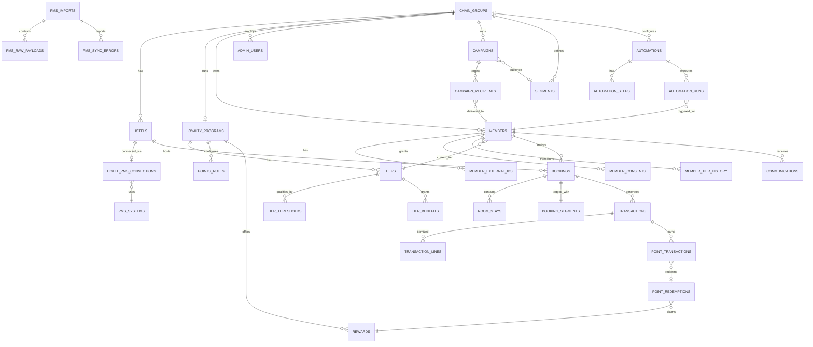

# Loyco Database — Architecture

**Status:** Draft (Fase 0). Pending signoff before implementation.
**Owner:** trobe + Claude
**Stack:** Supabase (Postgres 15), SQL migrations, TypeScript seed (Faker.js).

---

## 1. Purpose

Single Postgres database that serves as the foundation for:

- **Adminportal prototype** — Manage Members, Engage, Analytics
- **MCP / AI agents** — natural-language queries against customer data
- **Analytics & reporting** — direct booking share, CLV, churn, tier distribution
- **PMS data normalization** — common shape across StayNTouch, Mews, Protel Air, Visbook
- **Realistic simulation** — 5 chains × ~25 hotels × ~2 000 members × ~40 000 bookings

This database is **prototype-grade**: realistic enough to build and demo against, not production-grade GDPR/PCI-hardened.

---

## 2. Domain model (concepts)

```
ChainGroup (Loyco customer)
  ├── Hotels (departments in PMS terminology)
  │     └── PMS connection (StayNTouch | Mews | Protel Air | Visbook)
  │
  ├── Loyalty Program (one per chain by default)
  │     ├── Tiers (Bronze/Silver/Gold/Platinum, configurable per chain)
  │     ├── Points rules (per channel × segment × hotel)
  │     ├── Rewards catalogue
  │     └── Benefits per tier
  │
  ├── Members
  │     ├── External IDs (legacy migration data)
  │     ├── Consents (email, SMS, offers, user agreement)
  │     ├── Tier history (upgrades/downgrades)
  │     └── Point balance (derived)
  │
  ├── Bookings (PMS reservations)
  │     ├── Room stays (per-room, per-night)
  │     ├── Transactions (financial postings)
  │     │     └── Transaction lines (order_lines from PMS)
  │     └── Booking segments (market segment, rate code, source code)
  │
  ├── Communications
  │     ├── SMS messages
  │     ├── Email messages
  │     ├── Campaigns
  │     ├── Segments (audience definitions)
  │     └── Automations (trigger-based flows)
  │
  ├── Admin users (Loyco staff, chain admins, hotel staff, analysts)
  │
  └── PMS imports (audit trail of every PMS load)
```

Loyco-specific terminology mapped to schema:
- "Department" in PMS exports → `hotels` table (a department = a hotel)
- "Program" in PMS exports → `loyalty_programs` table (one program per chain typically)
- "Program Tag" → `program_tag` column on member (e.g., `364Silver`, `268plus`)

---

## 3. Tenancy model

**Primary tenant boundary:** `chain_group_id` (hotel chain).

| Role | Scope | Notes |
|---|---|---|
| `loyco_admin` | All chains | Loyco staff, support, agents |
| `chain_admin` | One chain | Sees all hotels in chain |
| `hotel_staff` | One or more hotels in a chain | Limited to assigned hotels |
| `analyst` | Read-only, scoped per assignment | For reporting users |

JWT claims:
- `app_role`: one of the four values above
- `chain_group_id`: UUID (or null for `loyco_admin`)
- `hotel_ids`: UUID[] (for `hotel_staff` only)

RLS helpers (in `public` schema):
- `lc_current_role()` → reads `auth.jwt() ->> 'app_role'`
- `lc_current_chain_id()` → reads `auth.jwt() ->> 'chain_group_id'`
- `lc_current_hotel_ids()` → reads `auth.jwt() -> 'hotel_ids'` as `uuid[]`
- `lc_is_loyco_admin()` → `lc_current_role() = 'loyco_admin'`

Default RLS policy (template):
```sql
USING (
  lc_is_loyco_admin()
  OR chain_group_id = lc_current_chain_id()
)
```
Hotel-scoped tables additionally check `hotel_id = ANY(lc_current_hotel_ids())` when role is `hotel_staff`.

---

## 4. Schema overview (table inventory)

All tables in `public` schema. Every table gets `id uuid PRIMARY KEY DEFAULT gen_random_uuid()`, `created_at timestamptz DEFAULT now()`, `updated_at timestamptz DEFAULT now()` unless noted.

### 4.1 Tenancy & catalog
| Table | Purpose |
|---|---|
| `chain_groups` | Hotel chains (Loyco customers) |
| `hotels` | Individual hotels (= "departments") |
| `pms_systems` | Catalog: stayntouch, mews, protel_air, visbook |
| `hotel_pms_connections` | Hotel ↔ PMS binding + connection metadata |
| `currencies` | ISO 4217 catalog |
| `currency_rates` | Daily FX rates |
| `regions` | Country/region catalog (NO/SE/DK/FI/etc.) |

### 4.2 Loyalty configuration (per chain)
| Table | Purpose |
|---|---|
| `loyalty_programs` | One program per chain (1:1 in MVP, but modeled as 1:N) |
| `tiers` | Configurable tiers per program (Bronze/Silver/Gold/Platinum + custom) |
| `tier_thresholds` | Qualification rules: points, nights, period |
| `tier_benefits` | Description of perks per tier (free-text + machine-readable flags) |
| `points_rules` | Per-channel/segment earning rules (% of payment) |
| `rewards` | Redeemable rewards catalogue |

### 4.3 Members
| Table | Purpose |
|---|---|
| `members` | Core member record (chain-scoped) |
| `member_external_ids` | Legacy IDs (e.g., FMOldId, SJprioId) — JSON-array source |
| `member_consents` | email, SMS, offer, user_agreement — historical audit |
| `member_tier_history` | Every upgrade/downgrade with reason + effective dates |
| `member_attributes` | Open-ended key-value tags (program tags, regions, custom flags) |

### 4.4 Bookings & stays
| Table | Purpose |
|---|---|
| `bookings` | Reservation header (1 row per PMS reservation) |
| `room_stays` | Per-room occupancy within a booking (multi-room support) |
| `booking_segments` | Market segment, rate code, source code, channel manager, travel agency |
| `booking_status_history` | State transitions: confirmed → checked_in → checked_out / cancelled |

### 4.5 Transactions & points
| Table | Purpose |
|---|---|
| `transactions` | Financial posting tied to a booking (matches Loyco's existing transactions export shape) |
| `transaction_lines` | Order line items (room, F&B, etc. — from PMS `order_lines` JSON) |
| `point_transactions` | Earn / redeem / adjustment / expiry — single source of truth for balance |
| `point_redemptions` | Reward redemption record (links point_transactions → rewards) |
| `points_balances_mv` | Materialized view: current balance + pending + expiring (refresh nightly) |

### 4.6 Communications & marketing
| Table | Purpose |
|---|---|
| `communications` | Unified base table for SMS + email (channel-typed) |
| `communication_templates` | Reusable message templates per chain |
| `campaigns` | Marketing campaigns (Engage module) |
| `campaign_recipients` | Per-member delivery + engagement record |
| `segments` | Audience definitions (rule tree as JSONB) |
| `automations` | Trigger-based flows (e.g., post-OTA invitation) |
| `automation_steps` | Ordered actions within an automation |
| `automation_runs` | Per-member execution log |

### 4.7 Admin & audit
| Table | Purpose |
|---|---|
| `admin_users` | Adminportal users (linked to `auth.users`) |
| `admin_user_hotel_assignments` | hotel_staff ↔ hotels mapping |
| `audit_log` | Append-only log: who did what, when, on what record |

### 4.8 PMS sync
| Table | Purpose |
|---|---|
| `pms_imports` | One row per import job (file or API run) |
| `pms_raw_payloads` | Raw JSONB payload per source row (for re-parse) |
| `pms_sync_errors` | Row-level failures with raw row + error |

---

## 5. ER diagram



A more detailed diagram (per-domain) lives in `docs/diagrams/`.

---

## 6. Critical design choices

### 6.1 Currency model

Every monetary column comes in pairs: `amount_<purpose>` (numeric(14,2)) + `currency_<purpose>` (char(3)). For transactions:
- `original_amount` / `original_currency` — what the guest paid
- `posted_amount` / `posted_currency` — booked into Loyco's reporting currency
- `fx_rate` / `fx_rate_date` — the rate used

Each chain has a `default_currency` and an optional `reporting_currency` (defaults to chain currency). Conversion uses `currency_rates(from_ccy, to_ccy, date, rate)`.

### 6.2 Points configuration (per chain, per channel, per segment)

`points_rules` columns:
```
program_id, hotel_id (nullable),
channel (enum), market_segment_code (nullable),
percent_of_payment numeric(5,2),    -- e.g., 2.00 / 5.00 / 10.00 / 15.00
tier_multiplier_override jsonb null, -- {"silver": 1.2, "gold": 1.5}
valid_from, valid_to, priority int
```
**Resolution algorithm** (per booking):
1. Filter rules by `program_id` and date range.
2. Pick the most specific match: `(hotel + segment) > hotel > segment > program-default`.
3. Apply tier multiplier (member's current tier).
4. Compute `points_earned = floor(payment_in_loyalty_currency * percent / 100 * multiplier)`.

**OTA exclusion:** rule with `channel='ota'` and `percent_of_payment=0` (default seeded for every chain).

`tiers` configurable per chain:
- name, sort_order, color_hex, icon_url
- thresholds (in `tier_thresholds`): `metric` (points|nights), `min_value`, `qualifying_period_months`
- benefits (in `tier_benefits`): `key` (e.g., `late_checkout`, `bonus_drink`), `value` (jsonb)

### 6.3 PMS normalization

Common columns on `bookings`:
```
chain_group_id, hotel_id, member_id (nullable),
pms_system enum, pms_reservation_no text,
arrival_date date, departure_date date,
check_in_at timestamptz null, check_out_at timestamptz null,
nights int generated, status enum (upcoming|in_house|checked_out|cancelled|no_show),
channel enum (direct|ota|corporate|group|walk_in|other),
total_amount numeric(14,2), currency char(3),
```
PMS-specific raw fields go into `pms_raw_payloads.payload jsonb`. The mapping from each PMS to `bookings` is implemented in seed scripts (and later in real ingestion code).

Mapping observations from attached files:
- **StayNTouch**: `Reservation Source = 'StayNTouchIntegration'`, `Department ID` → hotel, `Reservation Number`, dates with `Europe/Oslo` timezone, market segment in separate report
- **Mews**: `enterprise` (hotel name), `program_id`, `department_id`, `reservation_nr`, `origin = 'ChannelManager'`, `channel_manager` (Booking.com), `business_segment` (Rack rate / Unqualified discount rate), `rate_group` (OTA 48 timer / NRF-WEB), `rate` (Flex Booking / NonRef Booking), bill_amount/currency, Excel-serial dates
- **Protel Air**: present in members file as `Recruitement Source = 'ProtelAirPMSintegration'` — same booking shape assumed
- **Visbook**: not in attached samples — placeholder PMS

### 6.4 AI/MCP-friendly conventions

- **All identifiers in English, snake_case.**
- **`COMMENT ON TABLE` and `COMMENT ON COLUMN` for every table and every non-obvious column.** Generated MCP tools will surface these as descriptions.
- **Enums over free strings** for finite domains (channel, status, etc.).
- **Naming**: nouns plural for tables (`members`), `_id` suffix for FKs, `_at` for timestamps, `_date` for dates, `is_` for booleans, `*_history` for change-log tables.
- **No reserved words.** No abbreviations beyond well-known ones (`pms`, `ota`, `fx`, `mv`, `id`).
- **A `db_dictionary_view`** that joins `pg_tables` + `pg_attribute` + `pg_description` so an MCP server can fetch a self-describing schema in one query.

### 6.5 Audit logging

`audit_log(id, occurred_at, actor_user_id, actor_role, action, table_name, record_id, before jsonb, after jsonb, chain_group_id)`.

Implementation: trigger function `lc_audit_trigger()` attached to mutable tables (members, bookings, transactions, point_transactions, admin_users, tier configs).

### 6.6 Reporting layer (views)

| View | Domain |
|---|---|
| `member_360_view` | per-member overview: tier, balance, lifetime spend, last booking, next booking |
| `tier_distribution_view` | chain × tier × member_count × % |
| `direct_booking_share_view` | chain × month × direct_count / total_count |
| `revenue_per_member_view` | chain × month × revenue / member_count |
| `member_growth_view` | chain × month × new_members × cumulative |
| `churn_view` | chain × member × is_churned (no booking 12m + no points activity) |
| `clv_view` | per-member lifetime value (gross, net of redemptions) |
| `campaign_performance_view` | campaign × clicks × bookings_attributed × revenue_attributed |
| `chain_overview_view` | KPI rollup per chain |
| `hotel_comparison_view` | hotel × KPIs (RevPAR proxy, member share, direct share) |
| `points_balance_mv` | materialized — refreshed nightly |

---

## 7. Indexes (preliminary)

Beyond PK + FK indexes:

- `members(chain_group_id, lower(email))` UNIQUE
- `members(chain_group_id, phone_e164)` UNIQUE WHERE phone_e164 IS NOT NULL
- `members(chain_group_id, status)`
- `members(joined_at DESC)`
- `members(current_tier_id, status)`
- GIN `members(searchable_tsv)` — generated tsvector for full-text member search
- `bookings(member_id, arrival_date DESC)`
- `bookings(hotel_id, arrival_date)`
- `bookings(chain_group_id, arrival_date)`
- `bookings(channel, status)`
- `bookings(pms_system, pms_reservation_no)` UNIQUE
- `transactions(member_id, posting_date DESC)`
- `transactions(booking_id)`
- `transactions(chain_group_id, posting_date)`
- `point_transactions(member_id, occurred_at DESC)`
- `point_transactions(member_id) WHERE status='posted'` partial
- `communications(member_id, sent_at DESC)`
- `communications(channel, status)`
- `campaign_recipients(campaign_id, member_id)` UNIQUE

---

## 8. Out of scope (Fase 1–3)

- Real PMS ingestion adapters (we'll seed; later phase wires real API/file watchers)
- Adminportal frontend (separate repo, separate brief)
- MCP server implementation (separate brief; this DB is its data source)
- GDPR data minimization, retention policies, encryption at column level
- Real-money payment integration / Mastercard McKickback
- Point-expiry job scheduler (we'll model the schema for it; cron is later)

---

## 9. Tech & tooling

- **DB:** Supabase (Postgres 15)
- **Migration files:** numbered, idempotent where reasonable, in `supabase/migrations/`
- **Seed:** TypeScript using `@faker-js/faker` + `pg` directly. Script at `supabase/seed/seed.ts`. Deterministic via fixed RNG seed so re-runs produce identical data.
- **Verification:** SQL sanity queries in `scripts/verify.sql` + smoke RLS tests in `scripts/rls-tests.sql`
- **No ORM.** Raw SQL throughout — adminportal and MCP can pick their own client.

---

## 10. Open questions parked

See `MEMORY.md` for current open items. Strategic items are in `DECISIONS.md`.
